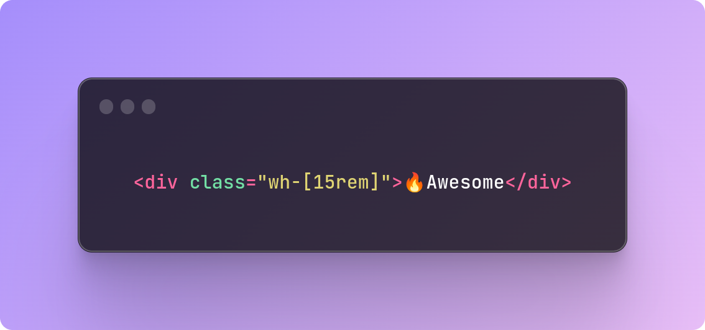

<p align="center">
    
    
    
</p>

<h1 align="center">Tailwindcss wh</h1>

<p align="center">Don't write the same number twice.</p>

> ✨ Help support the maintenance of this package by [sponsoring me](https://github.com/sponsors/sakanjo).

## ❔ Why

```html
<!-- Tired of writing {n} twice ? -->
<div class="w-12 h-12"></div>

<!-- Write {n} once -->
<div class="wh-12"></div>
```

## 📦 Installation

```
npm i -D tailwindcss-wh
```

## 🦄 Usage

Add the plugin to your `tailwind.config.js` file:

```js
// tailwind.config.js
import wh from 'tailwindcss-wh'

export default {
    // ...

    plugins: [
        wh(),
    ]
}
```

### Specifying selector name

```js
wh({ selector: 'square' }) // square-[15rem]
wh({ selector: 's' }) // s-4
```

## 💖 Support the development

**Do you like this project? Support it by donating**

Click the ["💖 Sponsor"](https://github.com/sponsors/sakanjo) at the top of this repo.

## ©️ Credits

- [Salah Kanjo](https://github.com/sakanjo)
- [All Contributors](../../contributors)

## 📄 License

[MIT License](https://github.com/sakanjo/tailwindcss-wh/blob/master/LICENSE) © 2023-PRESENT [Salah Kanjo](https://github.com/sakanjo)

